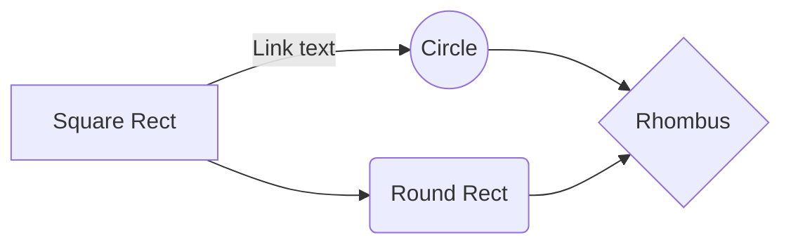

# Teste desenvolvedor full stack
- Criar uma API para criar e listar cadastros de nome, telefone e email
- Criar um front end para comunicação com a API
- Necessário utilizar Node e MongoDB
- O framework front/back é opcional (desejável Express e React)
- Testes em ambos são opcionais, mas seria legal ter
- Subir o teste em algum Git e nos enviar o link do repositório

## UML diagrams

# cbc-project
# cbc-project
